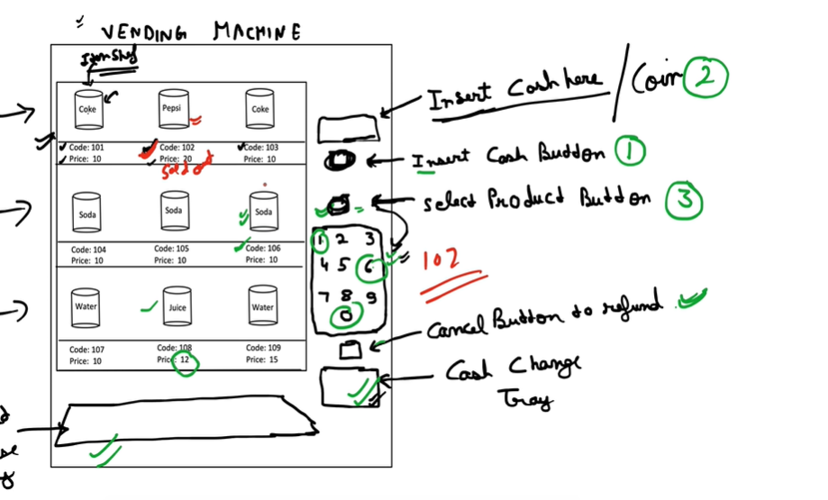
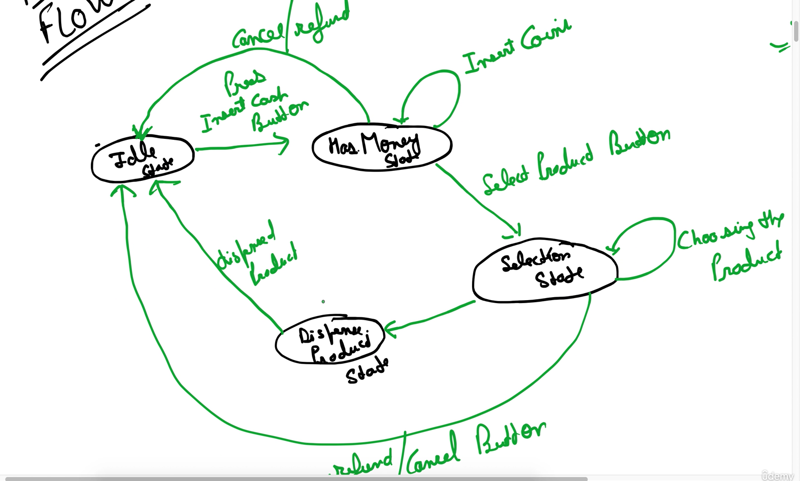
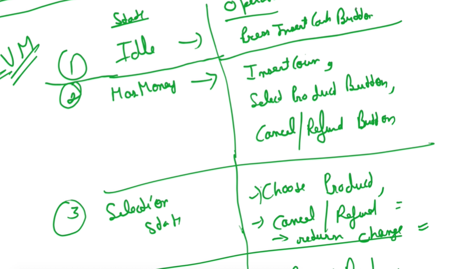

We create an interface with all the operations possible in all states

Now we implement this interface in the class u can say statewise,

we describe those methods which are required in that state and for other methods we just simply return exception or default response